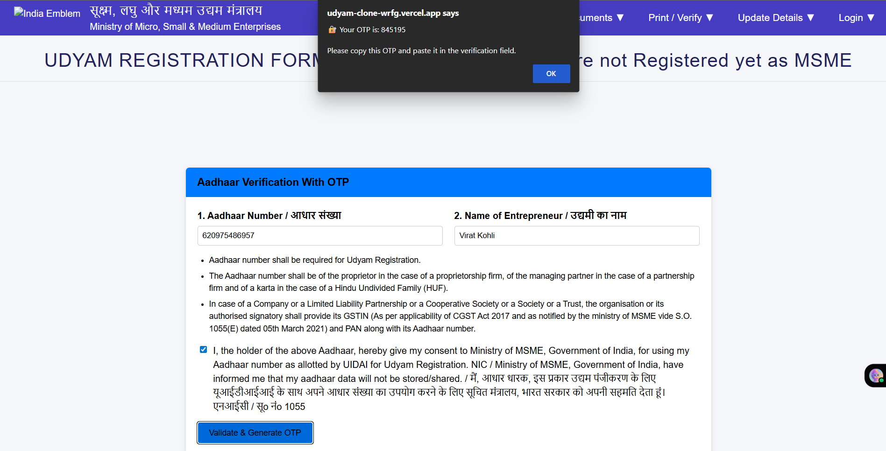
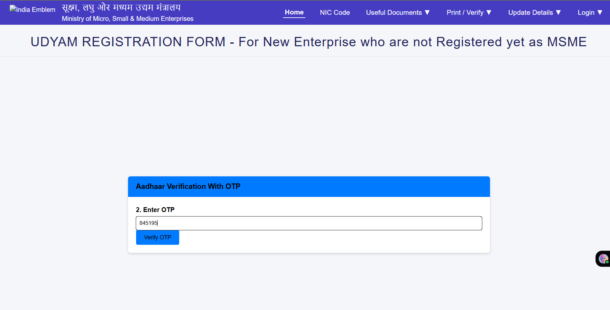
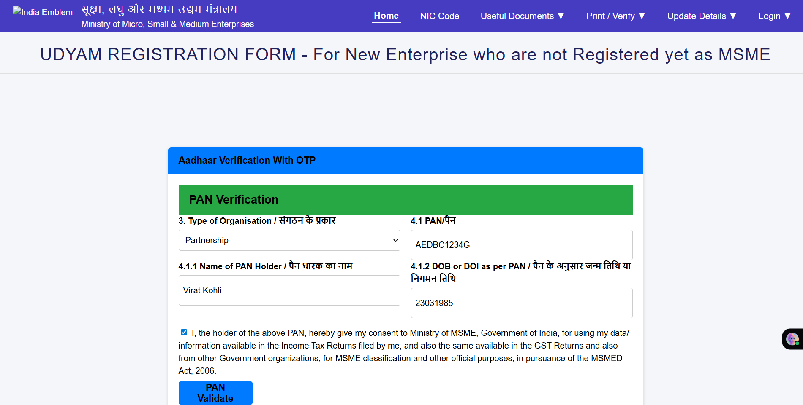
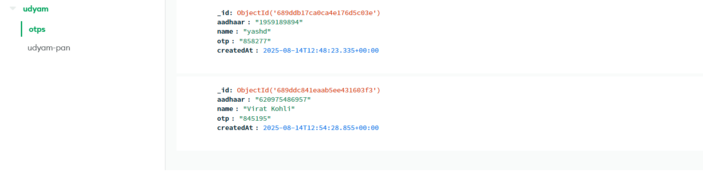
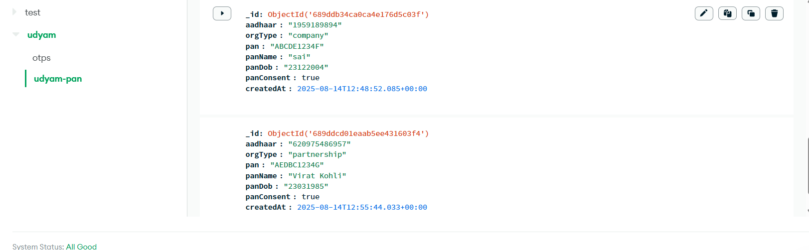

# 🏭 Udyam Registration Clone

<div align="center">


A complete full-stack clone of the **Udyam Registration Portal** with modern web technologies, featuring automated form scraping, OTP verification, and secure data storage.

</div>

## 🚀 Live Demo

**🌐 Udyam_cone Web Application**: [udyam-clone-wrfg.vercel.app](https://udyam-clone-wrfg.vercel.app)

**🔧 Frontend and Backend API**: Deployed on Vercel with MongoDB Atlas

---

## 📸 Application Screenshots

### 🔐 User Authentication Flow

<div align="center">
  
  
</div>

### 📝 Registration Process

<div align="center">
  
</div>

### 🗄️ Database Collections

<div align="center">
  
  
</div>

---

## ✨ Key Features

### 🎨 **Frontend (React + Vite)**

- **🎯 Pixel-Perfect UI**: Exact replica of the official Udyam portal design
- **📱 Responsive Design**: Works seamlessly on desktop, tablet, and mobile
- **🔄 Dynamic Forms**: Auto-generated forms based on scraped schema
- **⚡ Real-time Validation**: Instant feedback on Aadhaar and PAN formats
- **🔢 OTP Integration**: Secure verification with popup display
- **🎭 Interactive Flow**: Step-by-step registration process
- **🌐 Environment Management**: Easy API URL switching for dev/prod

### 🛡️ **Backend (Node.js + Express)**

- **🔐 Secure APIs**: RESTful endpoints with proper validation
- **📨 OTP System**: Generate and verify 6-digit OTPs
- **✅ Data Validation**: Schema-based validation using AJV
- **🗃️ MongoDB Integration**: Efficient data storage with multiple collections
- **🌍 CORS Enabled**: Cross-origin requests support
- **☁️ Serverless Ready**: Optimized for Vercel deployment
- **🔄 Connection Pooling**: Persistent MongoDB connections

### 🤖 **Web Scraper (Python)**

- **🕷️ Automated Extraction**: Selenium + BeautifulSoup for dynamic content
- **📋 Form Schema Generation**: Auto-creates JSON schema from official site
- **🔄 Sync Mechanism**: Keeps frontend/backend in sync with official changes
- **📊 Structured Output**: Clean JSON format for easy consumption

---

## 🏗️ Project Architecture

```
Udyam-clone/
├── 🎨 frontend/                 # React + Vite Application
│   ├── src/
│   │   ├── App.jsx             # Main application component
│   │   ├── App.css             # Styled to match official portal
│   │   └── components/         # Reusable React components
│   ├── .env                    # Environment variables (API URL)
│   ├── package.json            # Dependencies & scripts
│   └── vercel.json             # Vercel deployment config
│
├── 🛡️ backend/                  # Node.js + Express API
│   ├── api/
│   │   ├── index.js            # Main server file with all routes
│   │   └── form_schema.json    # Auto-generated form structure
│   ├── .env                    # MongoDB connection & secrets
│   ├── package.json            # Dependencies & scripts
│   └── vercel.json             # Vercel serverless config
│
├── 🤖 scraper/                  # Python Web Scraper
│   ├── scrape_udyam.py        # Main scraping script
│   ├── form_schema.json       # Generated schema output
│   └── venv/                  # Python virtual environment
│
└── 📸 images/                   # Screenshots for documentation
```

---

## 🛠️ Technology Stack

<div align="center">

| Category       | Technologies                                                                                                                                                                                                                   |
| -------------- | ------------------------------------------------------------------------------------------------------------------------------------------------------------------------------------------------------------------------------ |
| **Frontend**   |                   |
| **Backend**    |    |
| **Scraping**   |    |
| **Deployment** |                                                                    |
| **Tools**      |                                                                      |

</div>

---

## 🚀 Getting Started

### Prerequisites

- **Node.js** (v18 or higher)
- **Python** (v3.8 or higher)
- **MongoDB Atlas** account (or local MongoDB)
- **Git** for cloning

### 🔧 Local Development Setup

1. **Clone the Repository**

   ```bash
   git clone https://github.com/Sai-ganesh-0004/Udyam-clone.git
   cd Udyam-clone
   ```

2. **Setup Backend**

   ```bash
   cd backend
   npm install

   # Create .env file with your MongoDB connection string
   echo "MONGO_URI=your_mongodb_connection_string" > .env

   # Start backend server
   npm start
   ```

3. **Setup Frontend**

   ```bash
   cd ../frontend
   npm install

   # Create .env file with backend URL
   echo "VITE_API_URL=http://localhost:4000" > .env

   # Start development server
   npm run dev
   ```

4. **Setup Scraper (Optional)**

   ```bash
   cd ../scraper
   python -m venv venv
   source venv/bin/activate  # On Windows: venv\Scripts\activate
   pip install selenium beautifulsoup4 requests

   # Run scraper to update form schema
   python scrape_udyam.py
   ```

### 🌐 Access Points

- **Frontend**: http://localhost:5173
- **Backend API**: http://localhost:4000
- **API Health Check**: http://localhost:4000/api

---

## 🚢 Deployment Guide

### 📱 Frontend Deployment (Vercel)

1. Connect your GitHub repo to Vercel
2. Set root directory to `frontend`
3. Add environment variable: `VITE_API_URL=https://your-backend-url.vercel.app`
4. Deploy automatically on push to main

### 🛡️ Backend Deployment (Vercel)

1. Create new Vercel project for backend
2. Set root directory to `backend`
3. Add environment variable: `MONGO_URI=your_mongodb_atlas_connection_string`
4. Vercel will auto-detect Node.js and deploy as serverless functions

---

## 📋 API Endpoints

| Method | Endpoint            | Description              | Request Body                                           |
| ------ | ------------------- | ------------------------ | ------------------------------------------------------ |
| `GET`  | `/api`              | Health check             | -                                                      |
| `GET`  | `/api/schema`       | Get form schema          | -                                                      |
| `POST` | `/api/generate-otp` | Generate OTP for Aadhaar | `{aadhaar, name, consent}`                             |
| `POST` | `/api/verify-otp`   | Verify OTP               | `{aadhaar, otp}`                                       |
| `POST` | `/api/submit-pan`   | Submit PAN details       | `{aadhaar, orgType, pan, panName, panDob, panConsent}` |

---

## 🔐 Security Features

- **Input Validation**: Regex patterns for Aadhaar and PAN formats
- **OTP Security**: Time-based 6-digit OTP generation
- **CORS Protection**: Configured for specific origins
- **Environment Variables**: Sensitive data stored securely
- **Schema Validation**: AJV-based request validation
- **Error Handling**: Graceful error responses without data leakage

---

## 🎯 User Flow

1. **Aadhaar Entry** → User enters 12-digit Aadhaar number
2. **OTP Generation** → System generates and displays 6-digit OTP
3. **OTP Verification** → User enters OTP for validation
4. **PAN Details** → User fills organization type, PAN, name, and DOB
5. **Data Storage** → Information saved to MongoDB collections
6. **Loop Back** → Form resets for next user registration

---

## 🤝 Contributing

Contributions are welcome! Please feel free to submit a Pull Request. For major changes, please open an issue first to discuss what you would like to change.

1. Fork the Project
2. Create your Feature Branch (`git checkout -b feature/AmazingFeature`)
3. Commit your Changes (`git commit -m 'Add some AmazingFeature'`)
4. Push to the Branch (`git push origin feature/AmazingFeature`)
5. Open a Pull Request

---

## 📝 License

This project is licensed under the ISC License - see the [LICENSE](LICENSE) file for details.

---

## 🙏 Acknowledgments

- **Official Udyam Portal**: [udyamregistration.gov.in](https://udyamregistration.gov.in/) for design inspiration
- **Government of India**: Ministry of Micro, Small & Medium Enterprises
- **Open Source Community**: For the amazing tools and libraries used

---

## 👨‍💻 Author

**Simma Sai Ganesh**

- GitHub: [@Sai-ganesh-0004](https://github.com/Sai-ganesh-0004)
- Project Link: [https://github.com/Sai-ganesh-0004/Udyam-clone](https://github.com/Sai-ganesh-0004/Udyam-clone)

---

<div align="center">

**⭐ If you found this project helpful, please give it a star! ⭐**


</div>
